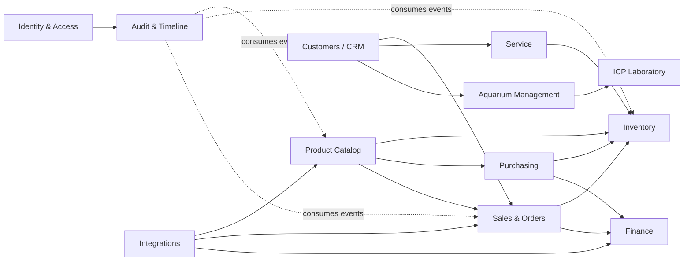
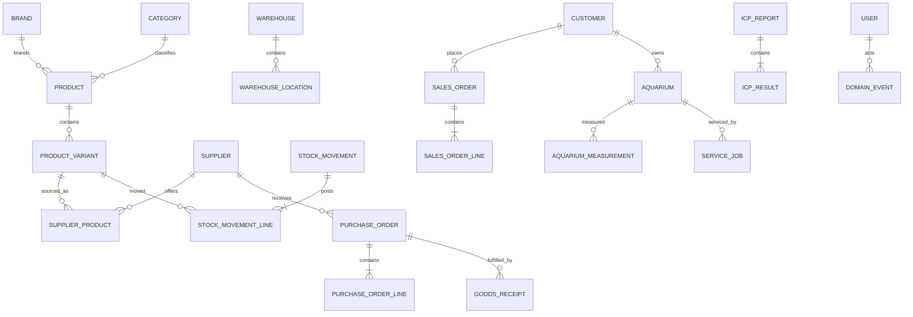
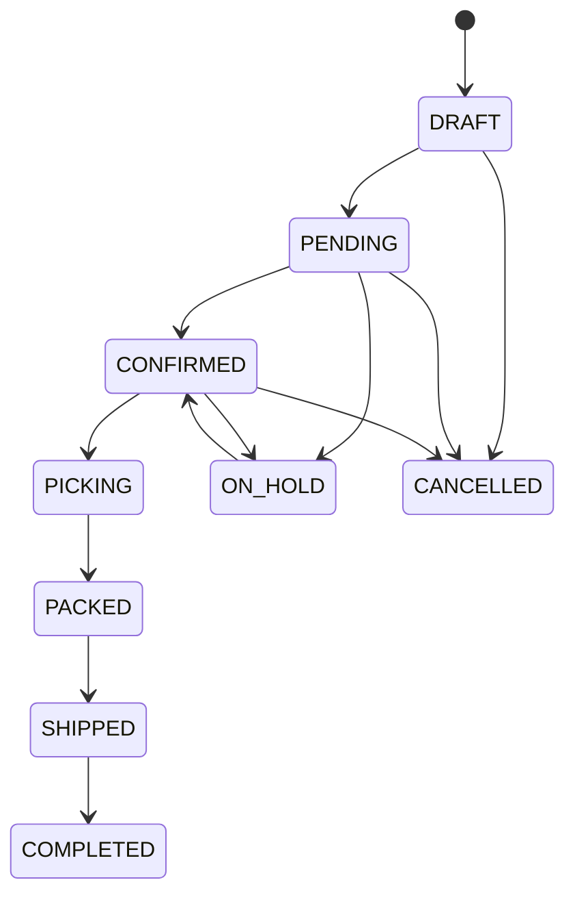
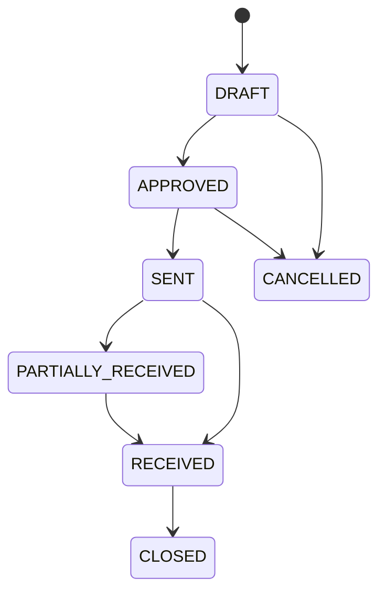
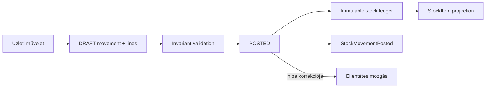
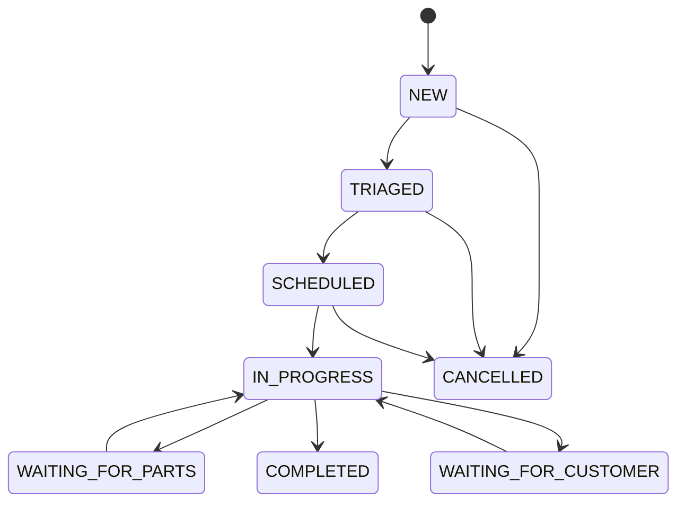

# Acropora OS domainmodell

## Cél és alapelvek

Ez a dokumentum az Acropora OS első domain-architektúráját rögzíti. A modellek üzleti határokat és tartós szerződéseket jelölnek; nem jelentenek kész CRUD modulokat. Minden bounded context a saját adatának source of truth-ja, más context adatait stabil belső azonosítóval hivatkozza, és domain eseményeken keresztül kommunikál.

Alapelvek:

- belső technikai ID: nem jelentéshordozó `cuid()`;
- üzleti ID: ember által olvasható, contexten belül egyedi szám (`orderNumber`, `sku`);
- pénz: `Decimal(19,4)` és ISO 4217 pénznemkód, floating point nélkül;
- mennyiség: `Decimal(19,6)` és explicit mértékegység;
- idő: PostgreSQL UTC időpont, a megjelenítés Europe/Budapest vagy felhasználói időzónában;
- törlés: üzleti törzsadat archiválandó (`archivedAt`/`isActive`), könyvelési és eseményadat nem törlendő;
- külső azonosító: kizárólag az Integrations context `ExternalReference` rekordja;
- készlet: kizárólag postolt mozgásokból vezethető le.

## Bounded contexteek

| Context             | Felelősség és fő entitások                            | Source of truth / birtokolt adat                                                 | Hivatkozott adat és kapcsolatok                                             |
| ------------------- | ----------------------------------------------------- | -------------------------------------------------------------------------------- | --------------------------------------------------------------------------- |
| Identity & Access   | felhasználó, session, role, permission                | `User`, `Session`, hozzáférési állapot                                           | más contextektől semmit; minden context `User.id`-t hivatkozhat aktorként   |
| Product Catalog     | UNAS terméktükör és értékesíthető változat            | helyi projection és Acropora `ProductExtension`; az UNAS a Product Master        | Supplier ID a Purchasingből; készletet nem birtokol                         |
| Inventory           | fizikai készlet főkönyve és foglalások                | raktár, location, movement/line, reservation, lot, serial, count                 | variant ID a Catalogból; rendelési és szerviz referenciák                   |
| Purchasing          | beszállítói rendelés és beérkeztetés                  | `Supplier`, contact, `PurchaseOrder`, `GoodsReceipt`, supplier invoice reference | variant, warehouse és finance referencia                                    |
| Sales & Orders      | rendelés, teljesítés és csatorna                      | `SalesOrder`, sorok, státusztörténet, shipment                                   | customer, variant; Inventory foglalást kér; Finance fizetési referenciát ad |
| Customers / CRM     | ügyféltörzs és ügyfélkapcsolatok                      | `Customer`, contact, address, note, tag, customer timeline                       | külső ID az Integrationsben; order/service/aquarium csak hivatkozza         |
| Finance             | pénzügyi tények referenciái                           | payment, refund, invoice reference, supplier invoice reference                   | order/purchase ID; a számla source of truth-ja a Számlázz.hu                |
| Service             | kérésből végrehajtott szervizmunka                    | request, `ServiceJob`, visit, task, time entry, material usage                   | customer/aquarium; anyagfelhasználással Inventory mozgást kér               |
| Aquarium Management | akvárium-nyilvántartás és üzemeltetés                 | `Aquarium`, equipment, livestock, measurement, task, visit, timeline             | customer és felelős user; ICP jelentést hivatkozik                          |
| ICP Laboratory      | minták, elemmérések és ajánlások                      | `IcpReport`, sample, result, element definition, recommendation                  | aquarium; labor/fájl külső referenciája Integrationsből                     |
| Integrations        | külső rendszerek megfeleltetése és adatcsere állapota | `ExternalReference`, sync state, integration event, webhook/import/export job    | minden aggregate belső ID-ját polimorf módon hivatkozza                     |
| Audit & Timeline    | technikai audit, üzleti esemény és olvasási timeline  | `AuditLog`, `DomainEvent`, contextenkénti `TimelineEvent`                        | user/aggregate ID; payload pillanatképet tárol, nem domain source of truth  |

## Aggregate-ek és értékobjektumok

Fő aggregate rootok: `User`, `Product`, `Warehouse`, `StockMovement`, `Supplier`, `PurchaseOrder`, `GoodsReceipt`, `Customer`, `SalesOrder`, `ServiceJob`, `Aquarium`, `IcpReport`. Gyermekentitást csak a saját aggregate root tranzakciója módosíthat; például `SalesOrderLine` nem önálló aggregate.

Logikai értékobjektumok (a Prisma első változatában beágyazott mezőcsoportok):

- `Money(amount, currency)` – pénznemazonos összeg;
- `Quantity(value, unit)` – pozitív mennyiség és mértékegység;
- `Address(country, postalCode, city, line1, line2)`;
- `DateRange` és `MeasurementValue(value, unit, parameterCode)`;
- `ExternalIdentity(system, entityType, externalId)`.

## Contextenkénti modellterv

### Product Catalog

Az UNAS-ban létező termékek Product Master rendszere az UNAS. A `Product` és
`ProductVariant` ezek helyi mirror projectionje; az Acropora-specifikus statikus
beállításokat a varianthez kapcsolt `ProductExtension` birtokolja. Részletes
döntés: [ADR-013](../adr/0013-unas-product-master-and-local-extension.md).

- `Product`: közös név, leírás, típus (`PHYSICAL`, `SERVICE`, `LIVESTOCK`), brand és kategória.
- `ProductVariant`: az egyedi belső SKU-val, unit- és áfaadatokkal rendelkező kereskedelmi egység.
- `Brand`, `Category`: rendezett törzsadat; a kategória önhivatkozó fával később taxonómiává bővíthető.
- `ProductBarcode`: varianthez tartozó több egyedi kód, legfeljebb egy elsődleges kóddal.
- `ProductImage`, `ProductDocument`: sorrendezett asset referencia, típus, címke és opcionális érvényesség.
- `PriceList`, `ProductPrice`: pénznem, customer/channel scope, érvényességi idő és variant ár. Átfedő prioritás szabálya nyitott kérdés.
- `SupplierProduct`: supplier + variant megfeleltetés saját supplier SKU-val, megnevezéssel és utolsó ismert árral.

### Inventory

- `Warehouse` és `WarehouseLocation`: raktár és azon belüli egyedi helykód.
- `StockMovement` és `StockMovementLine`: immutable postolt főkönyv; a fejléc üzleti okot és irányt, a sor variantet, mennyiséget, lot/serial és location referenciát tartalmaz.
- `StockItem`: újraépíthető on-hand/reserved olvasási projection, nem önálló készlettény.
- `StockReservation`: igényaggregate, variant, warehouse, quantity, expiry és státusz; post/release mozgással válik főkönyvi ténnyé.
- `StockAdjustment`: indoklással és jóváhagyással adjustment movementet készítő parancsaggregate.
- `StockCount` és `StockCountLine`: snapshot időpont, várt/mért mennyiség és eltérés; lezáráskor adjustment keletkezik.
- `Lot`: batch, beszállító, gyártási/lejárati dátum és karanténállapot.
- `SerialNumber`: egyedi variantpéldány és aktuális custody/állapot.

### Purchasing

- `Supplier`, `SupplierContact`: beszállítói törzs és több szerepkörös kapcsolattartó.
- `PurchaseOrder`, `PurchaseOrderLine`: jóváhagyható rendelés; a sor ordered/received mennyiséget, unit árat, supplier SKU-t és várható érkezést tart.
- `GoodsReceipt`, `GoodsReceiptLine`: egy Purchase Orderhez több részbeérkeztetés; received, accepted és rejected mennyiség külön mező.
- `SupplierInvoiceReference`: külső számlaazonosító, összeg/pénznem és Purchase Order/Goods Receipt kapcsolat, számviteli tartalom nélkül.

### Sales & Orders és Finance

- `SalesOrder`, `SalesOrderLine`, `OrderStatusHistory`: rendelési aggregate és append-only státusztörténet. A sor variantet hivatkozik, de megőrzi a kereskedelmi pillanatképet.
- `Payment`: rendeléshez rendelt pénzmozgási referencia saját payment státusszal.
- `Shipment`, `ShipmentPackage`: részszállítás, carrier/tracking és csomagtartalom saját fulfillment státusszal.
- `InvoiceReference`: Számlázz.hu számla- vagy stornóhivatkozás; a számla nem Acropora aggregate.
- `Refund`: paymenthez és opcionálisan orderhez kapcsolt visszatérítési referencia.
- `SalesChannel`: `UNAS`, `POS`, `MANUAL`, `SERVICE`, `API` eredet, nem azonos az external reference providerrel.

A rendelés, payment, invoice és shipment párhuzamos állapotgépek. Például egy `SHIPPED` rendelés paymentje lehet még `PENDING`, és több shipment tartozhat egyetlen orderhez; ezeket tilos egy közös státuszmezőbe összevonni.

### Customers / CRM

- `Customer`: `PERSON` vagy `COMPANY`, üzleti customer number, marketing hozzájárulások és archiválási állapot.
- `CustomerContact`: több kapcsolattartó szerepkörrel és elsődlegességgel.
- `CustomerAddress`: több billing/shipping cím, alapértelmezett jelzővel.
- `CustomerNote`: belső, authorhoz kötött megjegyzés külön láthatósággal.
- `CustomerTag`: sok-sokhoz címkézés; `CustomerTimelineEvent`: felhasználói CRM projection.
- UNAS és Számlázz.hu ID kizárólag `ExternalReference`, nem Customer mező.

### Service

- `ServiceRequest`: beérkező igény, csatorna és triage; egy vagy több `ServiceJob`-ot indíthat.
- `ServiceJob`, `ServiceJobStatusHistory`: végrehajtási aggregate és append-only státusztörténet.
- `ServiceVisit`: helyszín, tervezett/tényleges idő és résztvevők.
- `ServiceTask`: ellenőrzőlista-elem, felelős és teljesítés.
- `ServiceMaterialUsage`: variant + quantity; postolásakor készletmozgást kér.
- `ServiceTimeEntry`: user, kezdés/vég vagy duration és billable jelző; az anyaghasználattól független.

### Aquarium Management

- `Aquarium`: saját, bolti vagy customer tulajdon, geometria, rendszerűrtartalom, felelős és maintained-by-us állapot.
- `AquariumOwner`: időben érvényes customer/üzleti tulajdonosi kapcsolat.
- `AquariumEquipment`, `AquariumLivestock`: berendezés- és lakónyilvántartás product/variant opcionális referenciával.
- `AquariumMeasurement`: bővíthető parameter code, decimal value, unit és időpont; nem fix vízparaméter-oszlopok.
- `AquariumTask`, `AquariumMaintenanceVisit`: ütemezett feladat és karbantartási alkalom.
- `AquariumTimelineEvent`: akváriumhoz vetített, felhasználói aktivitás.

### ICP Laboratory

- `IcpReport`: labor, aquarium/sample, időpont és eredeti PDF/fájl hash-referencia.
- `IcpSample`: mintakód, levétel ideje, víztípus és chain-of-custody.
- `IcpResult`: element code, mért value/unit, min/max/target és trend.
- `IcpElementDefinition`: laborfüggetlen elemnév, alapegység és megjelenítési metadata.
- `IcpRecommendation`: result/report scope, AI vagy `EXPERT` forrás, szöveg, model/version és jóváhagyó; a provenance kötelező.

### Integrations és Audit

- `ExternalReference`: providerfüggetlen külső azonosító-megfeleltetés.
- `IntegrationSyncState`, `IntegrationEvent`: idempotens sync állapot és provideresemény.
- `WebhookDelivery`: request hash, attempt, response és retry időpont.
- `ImportJob`, `ExportJob`: fájl/batch feldolgozás, progress, hibajegyzék és artifact referencia.
- `AuditLog`, `DomainEvent`, `TimelineEvent`: egymástól elválasztott technikai, üzleti és prezentációs eseményréteg.

## Üzleti invariánsok

- Egy `ProductVariant.sku` globálisan egyedi; a Product önmagában nem készletezhető és nem értékesíthető egység.
- Fizikai vagy élőlény variant mozgatható készleten; szolgáltatás variant nem növeli az on-hand készletet.
- Postolt StockMovement nem írható át; korrekciója ellenmozgás. A sor mennyisége pozitív, irányát a típus és forrás/cél határozza meg.
- Transfer esetén forrás- és célraktár szükséges és nem lehet azonos. A készletprojection újraépíthető a postolt sorokból.
- Purchase Order csak `DRAFT` állapotból hagyható jóvá; összes elfogadott beérkezés nem haladhatja meg az engedélyezett eltérést.
- Goods Receipt postolása atomikusan `PURCHASE_RECEIPT` mozgást és `GoodsReceived` eseményt eredményez.
- Sales Order státusza független a payment, invoice és shipment állapotától. Megerősítéskor a készletfoglalás külön Inventory művelet.
- Pénzösszegek csak azonos pénznemben összegezhetők; a rendelési sor pillanatképe megőrzi a SKU-t, leírást és árat.
- Service material usage postolása Inventory `SALE` vagy dedikált belső felhasználási szabály szerinti mozgást generál; időráfordítás ettől független.
- Akváriummérés paraméterkód + érték + mértékegység hármas; az elemkészlet bővíthető sémamódosítás nélkül.
- Külső referenciánál ugyanazon rendszer/entity type/external ID csak egy belső aggregate-hez tartozhat.
- Domain esemény event ID-ja idempotenciakulcs; payload szerződését `schemaVersion` verziózza.

## Készletfogalmak

- **on hand**: fizikailag jelen lévő mennyiség a postolt mozgások nettó eredménye alapján.
- **reserved**: érvényes foglalásokkal lekötött, de még fizikailag jelen lévő mennyiség.
- **available**: `on hand - reserved - quarantine`; amit új igény számára ígérhetünk.
- **incoming**: jóváhagyott/sent beszerzési sor még át nem vett mennyisége.
- **committed**: megerősített vevői vagy szervizigény, amelyhez teljesítés szükséges; lehet részben még nem foglalt.

## Státuszfolyamatok

## Domain eventek

A `packages/types` verziózott `DomainEventEnvelope` szerződése tartalmazza az esemény-, aggregate-, actor- és korrelációs metaadatot. Első eseménykészlet: `ProductCreated`, `StockMovementPosted`, `PurchaseOrderApproved`, `GoodsReceived`, `SalesOrderConfirmed`, `SalesOrderShipped`, `CustomerCreated`, `ServiceJobCompleted`, `AquariumMeasurementRecorded`, `IcpReportImported`.

Az esemény múlt idejű tényt ír le, nem parancs. A producer ugyanabban a logikai tranzakcióban rögzíti a `DomainEvent` rekordot, mint az aggregate-változást; megbízható aszinkron publikálásához később outbox dispatcher készül.

## Audit- és timeline-stratégia

- **AuditLog:** biztonsági és technikai változásnapló (ki, mit, mikor, milyen kliensből). Korlátozott hozzáférésű, nem üzleti integrációs szerződés.
- **DomainEvent:** megváltoztathatatlan üzleti tény, gépi feldolgozásra és context-integrációra; verziózott payload.
- **TimelineEvent:** felhasználói olvasási modell lokalizálható címmel, szereplővel és láthatósággal. Domain eseményből vagy explicit felhasználói műveletből származhat.

Nem minden auditbejegyzés domain esemény, és nem minden domain esemény jelenik meg timeline-ban. A timeline projection újraépíthető; az audit retention külön biztonsági/GDPR szabályt követ.

## Későbbi modellbővítések

A dokumentált, de a core Prisma sémában még nem részletezett gyermekmodellek: ProductImage/Document, PriceList/ProductPrice, reservation/count/lot/serial, contacts/notes/tags, payment/refund/shipment/invoice references, teljes service worklog, aquarium equipment/livestock/task/visit, ICP sample/element/recommendation, webhook/import/export és felhasználói timeline projection. Ezek határa és ownershipje már rögzített; részletezésük a hozzájuk tartozó üzleti sprintben történik.
